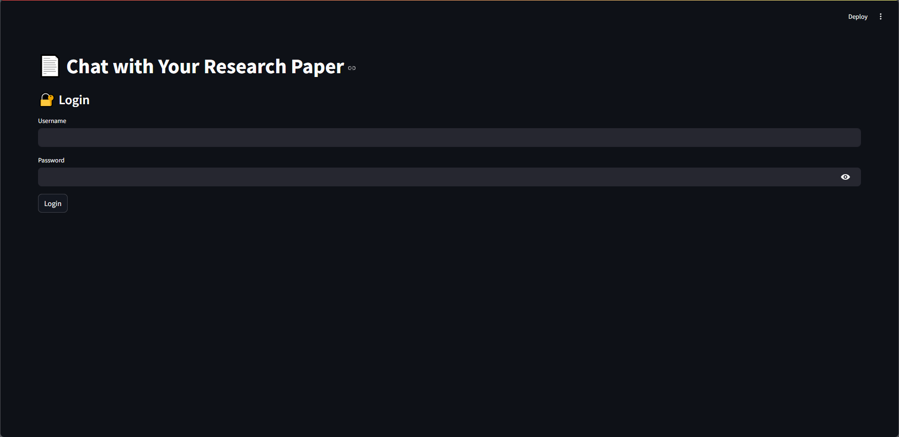
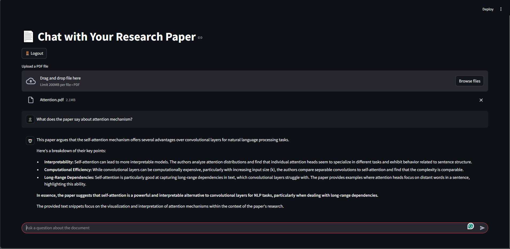

# 📄 PDF Chatbot – Chat with Your Research Papers Using LangGraph + Streamlit

PDF Chatbot is an intelligent document assistant that lets you **chat with your uploaded PDFs** like you're talking to ChatGPT – but with research context.

Built using **LangGraph**, **LangChain**, **Streamlit**, and **FAISS**, this tool retrieves relevant content from your uploaded paper and answers questions contextually.

---

## 🚀 Features

- 🔐 **Login system** with password authentication  
- 🧠 **Conversational QA** over PDF content  
- 💬 **Chat-style UI** with persistent history (ChatGPT-style)  
- 💾 **User-specific storage** of vector embeddings and chat history  
- 🧭 **LangGraph-powered multi-step retrieval and response flow**  
- 📚 **FAISS vector store** for efficient document retrieval  
- ⏱️ **Session timeout & logout**

---

## 🛠️ Tech Stack

| Tool         | Purpose                            |
|--------------|-------------------------------------|
| Streamlit    | UI & web app framework              |
| LangGraph    | State management & workflow control |
| LangChain    | LLM orchestration and chains        |
| FAISS        | Document similarity search          |
| PyMuPDF      | PDF text extraction                 |

---

## 📂 Folder Structure

```bash
pdf_chatbot/
├── app.py                # Main Streamlit app
├── utils.py              # Utility functions (auth, save/load)
├── qa_chain.py           # LangGraph chain definition
├── user_data/            # Per-user saved vectorstores & chats
└── README.md             # This file
```

---

## 🔧 Setup Instructions

### 1. Clone the repo

```bash
git clone https://github.com/aljaziz/PDF-Chatbot.git
cd PDF-Chatbot
```

### 2. Install dependencies

```bash
pip install -r requirements.txt
```

Requirements include:
- streamlit
- langgraph
- langchain
- langchain_groq
- langchain_community
- faiss-cpu
- PyMuPDF
- sentence-transformers

### 3. Add your OpenAI API key

```bash
export GROQ_API_KEY=your_groq_api_key  # Or set it in your .env
export HF_TOKEN=your_hf_token
```

### 4. Run the app
```bash
stremalit run app.py
```

## 👤 Login Credentials (Demo)
These are hardcoded in ```utils.py``` for demonstration:
```python
USERS = {
    "alice": sha256("password123"),
    "bob": sha256("secure456")
}
```
🔒 You can replace this with a real database + password hashing in production.

## 📸 Demo Screenshot



## 📌 Future Enhancements
- 🔄 Support multiple PDFs per user
- 📝 Export chat as Markdown or PDF
- 📡 Deploy with Firebase/Supabase auth
- 🔐 Signup/registration system
- 🧾 Source citation links in answers

## 🤝 Contributing
PRs are welcome! If you found a bug or want to suggest a feature, feel free to open an issue.

## 🧠 Credit
Built using:

- [LangGraph](https://github.com/langchain-ai/langgraph)
- [LangChain](https://www.langchain.com/)
- [Streamlit](https://streamlit.io/)
- [FAISS](https://github.com/facebookresearch/faiss)
